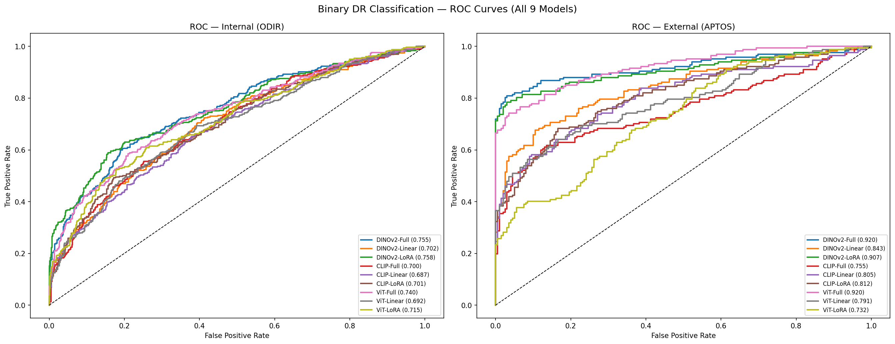
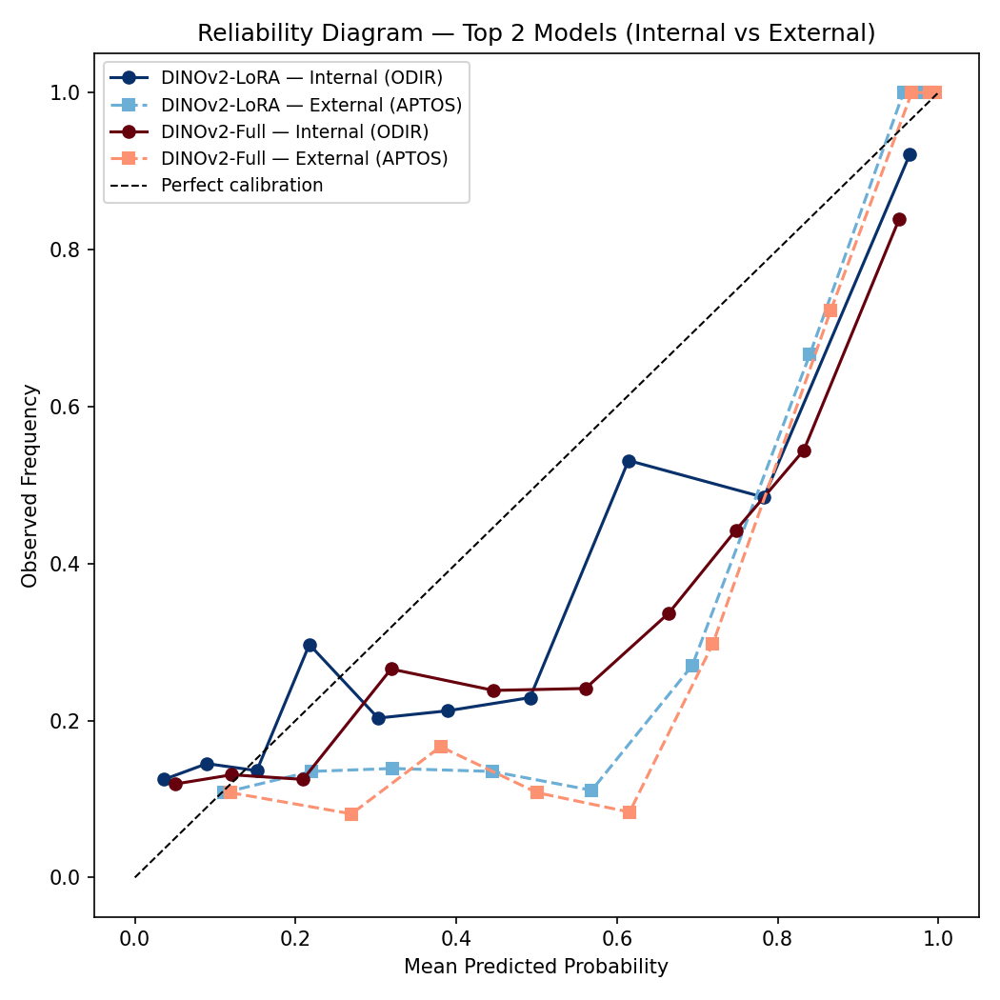
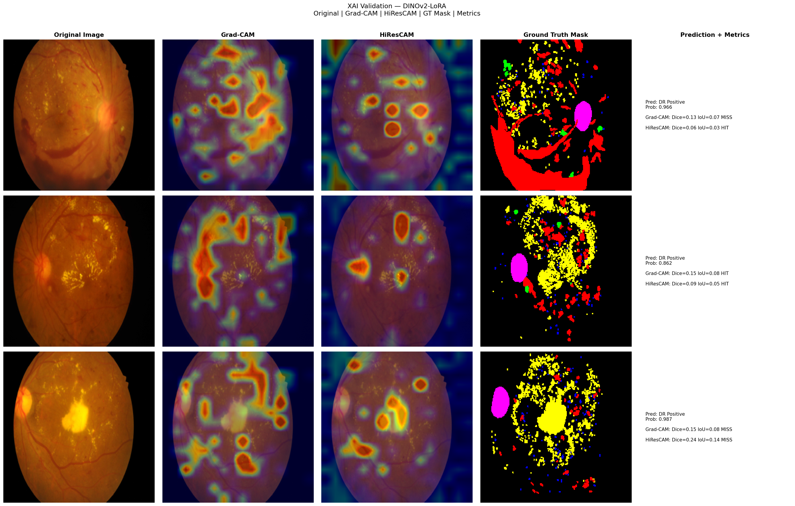

# Explainable Retinal Disease Classification using Vision Foundation Models

## Benchmarking DINOv2, CLIP and Vision Transformer Models with Explainable AI Validation


## Overview

Deep learning models have shown promising results for automated retinal disease diagnosis from fundus images. However, for medical applications, model transparency and reliability are essential.

In this project, we investigate the performance of vision foundation models for retinal disease classification and evaluate their explainability using lesion-level annotations.

We benchmark three pretrained vision architectures:

- DINOv2
- CLIP
- Vision Transformer (ViT)

using different adaptation strategies:

- Full Fine-tuning
- Linear Probing
- LoRA (Low-Rank Adaptation)


The project focuses on two main objectives:

1. Achieving strong retinal disease classification performance.
2. Understanding whether model predictions are based on clinically meaningful retinal regions.


---

# Dataset Description


Three publicly available retinal datasets were used for training, external evaluation, and explainability validation.


## ODIR-5K

ODIR-5K was used as the primary training dataset.

The dataset contains retinal fundus images covering multiple ophthalmic conditions.

| Dataset | Number of Images | Purpose |
|---|---:|---|
| ODIR-5K | 12,784 | Training and Internal Evaluation |


---

## APTOS 2019


APTOS 2019 Blindness Detection dataset was used for external evaluation.

The original diabetic retinopathy grading was converted into binary classification:

| Original Grade | Class |
|---|---|
| 0 | No DR |
| 1-4 | DR |


| Dataset | Purpose |
|---|---|
| APTOS 2019 | External Testing |


---

## IDRiD


IDRiD was used only for explainability validation because it provides expert lesion segmentation masks.

The segmentation annotations include:

- Microaneurysms (MA)
- Hemorrhages (HE)
- Hard Exudates (EX)
- Soft Exudates (SE)


A segmentation subset containing 54 images was used for quantitative XAI evaluation.


---

# Methodology


The complete workflow consists of:


1. Retinal image preprocessing

2. Feature extraction using pretrained vision foundation models

3. Model adaptation using different fine-tuning strategies

4. Disease classification

5. External validation on APTOS

6. Explainability evaluation using Grad-CAM and HiResCAM


---

# Model Architectures


Nine different models were evaluated:


| Backbone | Strategy |
|---|---|
| DINOv2 | Full Fine-tuning |
| DINOv2 | Linear Probe |
| DINOv2 | LoRA |
| CLIP | Full Fine-tuning |
| CLIP | Linear Probe |
| CLIP | LoRA |
| ViT | Full Fine-tuning |
| ViT | Linear Probe |
| ViT | LoRA |


---

# Fine-Tuning Strategies


## Full Fine-Tuning

The complete pretrained model parameters are updated during training.

Advantages:

- Maximum adaptation capability
- Better task-specific learning


---

## Linear Probing

The pretrained backbone is frozen and only the classification head is trained.

Advantages:

- Faster training
- Less computational cost


---

## LoRA Fine-Tuning

Low-Rank Adaptation introduces small trainable parameters while keeping the main backbone frozen.

Advantages:

- Parameter efficient
- Lower memory requirements
- Maintains pretrained knowledge


---

# Evaluation Metrics


## Classification Metrics

Models were evaluated using:

- AUROC
- Confidence Intervals
- Calibration Analysis


## Explainability Metrics

Generated explanations were compared with expert segmentation masks using:

- Dice Score
- Intersection over Union (IoU)
- Pointing Game Accuracy


---

# Model Performance

AUROC comparison of all evaluated models.

| Model | Internal AUROC (95% CI) | External AUROC (95% CI) |
|---|---|---|
| DINOv2-Full | 0.756 (0.731, 0.778) | 0.920 (0.886, 0.952) |
| DINOv2-Linear | 0.703 (0.679, 0.727) | 0.843 (0.801, 0.884) |
| DINOv2-LoRA | 0.758 (0.733, 0.782) | 0.907 (0.869, 0.940) |
| CLIP-Full | 0.701 (0.676, 0.726) | 0.756 (0.697, 0.809) |
| CLIP-Linear | 0.686 (0.662, 0.709) | 0.805 (0.758, 0.848) |
| CLIP-LoRA | 0.701 (0.676, 0.726) | 0.811 (0.764, 0.856) |
| ViT-Full | 0.740 (0.713, 0.763) | 0.920 (0.890, 0.947) |
| ViT-Linear | 0.692 (0.666, 0.718) | 0.791 (0.741, 0.835) |
| ViT-LoRA | 0.716 (0.690, 0.739) | 0.732 (0.681, 0.778) |


---

# ROC Curve Analysis


ROC curves show the ability of each model to distinguish between diseased and non-diseased retinal images.

Higher AUROC indicates better classification performance.





---

# Calibration Analysis


Calibration curves evaluate whether predicted probabilities represent the true confidence of the model.

A well-calibrated model should provide reliable confidence estimates.





---

# Explainable AI Visualization


To understand model decisions, Grad-CAM and HiResCAM were applied.

These methods generate heatmaps showing which retinal regions influenced the prediction.


The generated explanations were compared with expert lesion segmentation masks from IDRiD.





The visualization demonstrates that the model focuses on retinal regions containing disease-related abnormalities such as lesions and pathological structures.


---

# Results Files


Complete numerical results are provided in:

results/final_results_9models.json


Explainability evaluation results:

results/xai_metrics_final.csv

results/xai_metrics_lesiononly.csv


---


# Key Findings

- DINOv2 and ViT foundation models achieved the strongest generalization performance.
- DINOv2-LoRA achieved the highest internal AUROC while requiring fewer trainable parameters.
- External validation on APTOS demonstrated strong transferability across datasets.
- Grad-CAM and HiResCAM showed that models focused on clinically relevant retinal regions.


---

# Limitations


The current study has several limitations:


- Experiments were performed using publicly available datasets only.

- Differences in imaging devices and patient populations may affect generalization.

- Explainability methods provide visual evidence but cannot completely represent clinical reasoning.

- Further evaluation with ophthalmologists is required.


---

# Future Work


Future research directions include:


## Multi-Class and Multi-Label Disease Detection


Currently, the study mainly focuses on binary diabetic retinopathy classification.

Future work will extend the framework towards:

- Multi-class retinal disease classification

- Multi-label disease detection


This will better represent real clinical scenarios where a patient may have multiple retinal diseases simultaneously.


Possible target diseases include:

- Diabetic Retinopathy
- Glaucoma
- Cataract
- Age-related Macular Degeneration


---

## Larger Clinical Validation


Future studies should include:

- Multi-center datasets
- Different imaging devices
- Diverse patient populations


---

## Multimodal Clinical AI


Future models can combine:

- Retinal images
- Patient metadata
- Clinical information


to develop more comprehensive decision-support systems.


---


# Model Checkpoints

Due to large file size, trained checkpoints are not included in this repository.

The models can be reproduced by running the training pipeline in the notebook.

The code automatically trains models if checkpoint files are unavailable.

The pretrained checkpoints can be downloaded from the following link:

[Download Model Checkpoints] (https://drive.google.com/drive/folders/16k0PnQQzhyuYyOKibrzkeP5bf6iYAG1K?usp=sharing)


---


## Checkpoint Setup

After downloading the checkpoints, create the following folder structure in Google Drive:

```text
MyDrive/
└── Retinal_project/
    └── checkpoints/
        ├── ckpt_dinov2_full.pth
        ├── ckpt_dinov2_linear.pth
        ├── ckpt_dinov2_lora.pth
        ├── ckpt_clip_full.pth
        ├── ckpt_clip_linear.pth
        ├── ckpt_clip_lora.pth
        ├── ckpt_vit_full.pth
        ├── ckpt_vit_linear.pth
        └── ckpt_vit_lora.pth
```


The notebook automatically checks whether checkpoint files are available.

- If checkpoints are found, the trained models are loaded directly.
- If checkpoints are unavailable, the training process starts from scratch.


---

# Acknowledgements


We would like to thank Prof. Juan Miguel Lopez and Prof. Dr. Nils Strodthoff for their valuable suggestions, constructive feedback, and guidance during regular consultations, which significantly contributed to improving the methodology, evaluation framework, and overall quality of this work.


---


# License


This project is intended for research and educational purposes.


